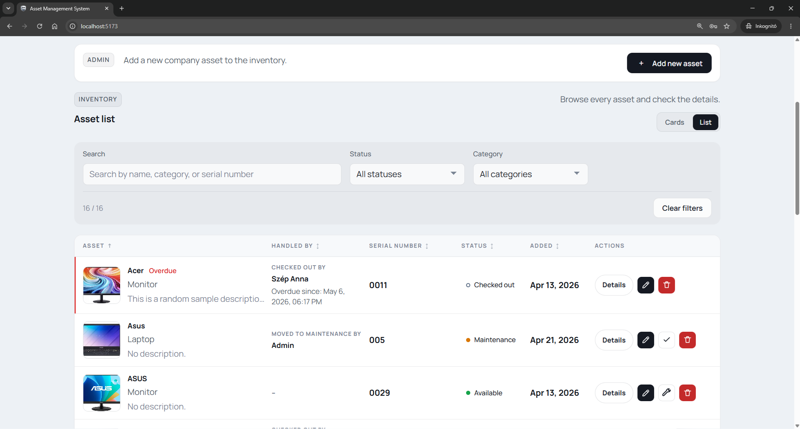
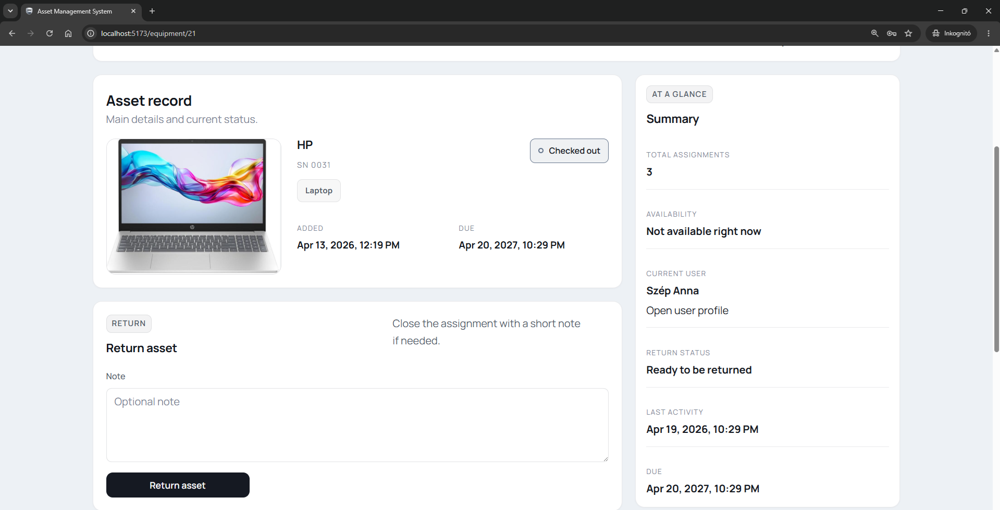
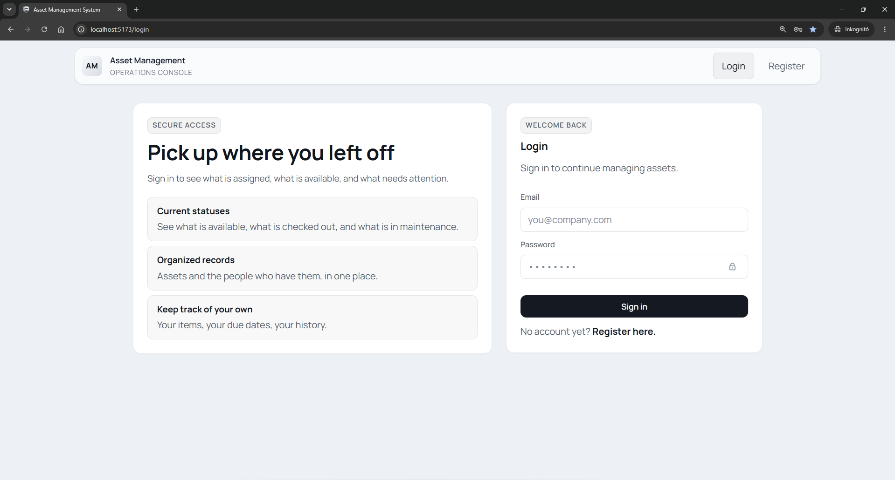
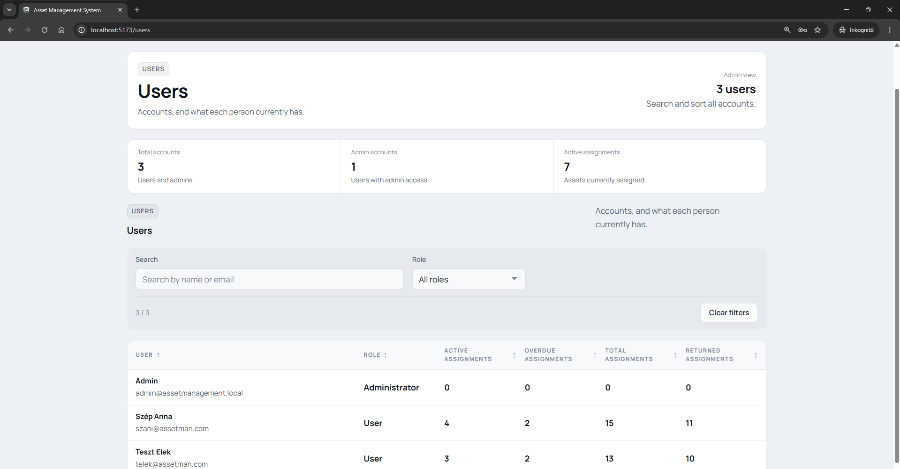
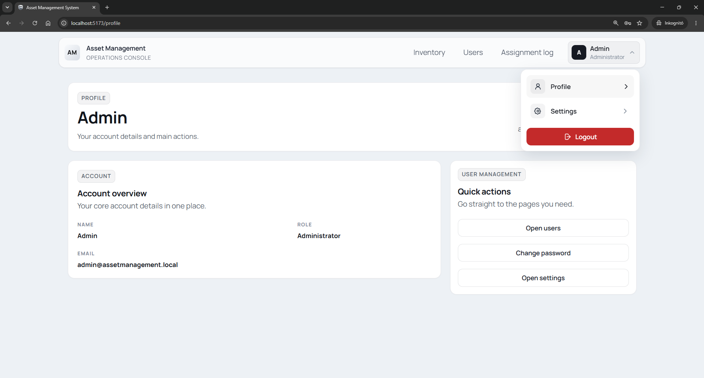
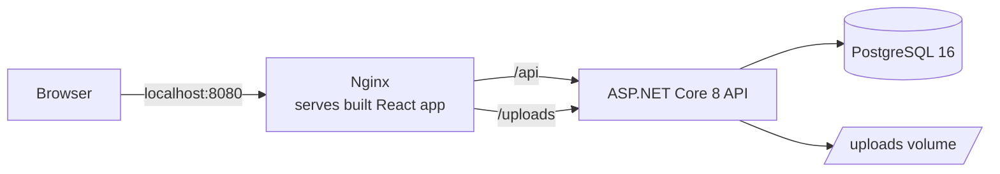

# Asset Management System

[](https://github.com/20davo/asset-management-system/actions/workflows/ci.yml)


An internal web app for tracking company equipment. It answers the three questions a small IT team asks every week. What do we own? Who has it right now? When is it coming back?

The idea came from a real gap. Spreadsheets fall apart once more than a few people touch them, and enterprise asset platforms cost more than a small team can justify. This app sits between the two. It follows each asset from checkout to return, without the price tag or the setup work of a full platform.

Two roles split the work. Regular users browse the inventory and check assets out and back in. Admins manage the assets, the users, and the full assignment history.

I built it as a full-stack portfolio project with ASP.NET Core 8, React 19 with TypeScript, and PostgreSQL. The whole stack runs in Docker Compose, in development mode and in a production-like mode behind Nginx.

## Screenshots

| Inventory | Asset details |
| --- | --- |
|  |  |

<details>
<summary>More screenshots (login, user management, account settings)</summary>







</details>

## Features

- JWT login with two roles (admin and regular user), enforced in the API, not only in the UI
- Equipment inventory with search, filters, due-date warnings, card and list views, and sortable columns
- Checkout and return flow with due dates, notes, and complete assignment history
- Admin tools for creating, editing, and deleting assets, a maintenance state, and assigning assets to users
- User management with role editing and protection rules, including for the last admin account
- A `My Items` page where users see their active and returned assets
- Equipment image upload with strict validation, served only to signed-in users
- Bilingual UI (English and Hungarian) with light and dark appearance
- Registration, login rate limiting, and a bootstrap admin account controlled by environment settings

## Engineering highlights

The parts of the codebase that go beyond basic CRUD:

- **Role and password changes take effect immediately.** Token validation re-checks the user's role and token version in the database on every request ([ServiceCollectionExtensions.cs](./api/AssetManagement/AssetManagement.Api/Extensions/ServiceCollectionExtensions.cs)). A removed admin role locks the user out right away, and changing a password invalidates every earlier token while the current session receives a fresh one.
- **Defensive upload pipeline.** Images are validated by size, extension, content type, and file signature (magic bytes), stored under random names, and served through an authenticated endpoint instead of public static files ([EquipmentImageService.cs](./api/AssetManagement/AssetManagement.Api/Services/EquipmentImageService.cs)).
- **One result pattern across the API.** Services return a `ServiceResult` with a machine-readable code. Controllers turn it into the right HTTP response, and the frontend maps the same code to an English or Hungarian message ([ServiceResult.cs](./api/AssetManagement/AssetManagement.Api/Services/ServiceResult.cs), [apiMessages.ts](./frontend/src/utils/apiMessages.ts)).
- **Same-origin production mode.** In the production-like stack, Nginx serves the built frontend and proxies `/api` and `/uploads`, and the API and database are not published on host ports at all ([compose.prod.yaml](./compose.prod.yaml)).
- **Fail-fast configuration.** The API refuses to start with a placeholder JWT key or an empty CORS origin list, so a misconfigured deployment fails loudly instead of running insecurely.
- **Login rate limiting.** A fixed-window limiter per IP and path protects the auth endpoints and returns structured JSON `429` responses.
- **Concurrency-safe checkout.** A partial unique index allows at most one active assignment per asset at the database level, so two simultaneous checkout requests cannot both succeed. Unique-constraint races on emails and serial numbers are caught and returned as friendly errors instead of `500`s. Integration tests prove this against a real PostgreSQL container.
- **Shareable list state.** Search, filters, sorting, and view mode live in the URL query string, so any filtered view survives a refresh and can be shared as a link.

## Architecture



The diagram shows the production-like mode. The development stack has no Nginx. There the Vite dev server runs on port 5173 and calls the API directly on port 5071, with CORS configured for it.

Backend requests flow through thin controllers into a service layer behind interfaces, which uses EF Core with PostgreSQL. Responses use DTOs, so EF entities never leave the API.

```text
api/AssetManagement/      ASP.NET Core solution (API project + xUnit test project)
frontend/                 React + TypeScript app (Vite)
compose.yaml              development stack
compose.prod.yaml         production-like overrides (Nginx, no exposed API/DB ports)
.github/workflows/ci.yml  CI pipeline
```

## Getting started

You need Docker Desktop (or Docker Engine with Compose).

```sh
cp .env.example .env
docker compose up --build
```

Open `http://localhost:5173`. The example values work for local development out of the box, including a bootstrap admin account:

- email: `admin@assetmanagement.local`
- password: `Admin123!`

EF Core migrations run automatically on startup, and the bootstrap admin is created from the `.env` values. Public registration creates regular user accounts only.

### Production-like mode

```sh
docker compose -f compose.yaml -f compose.prod.yaml up --build
```

Open `http://localhost:8080`. In this mode the frontend is a static build served by Nginx, everything runs on one origin, registration is disabled, and login rate limiting is on.

## Configuration

All settings come from a root `.env` file, documented in [.env.example](./.env.example). The main groups:

- host ports and PostgreSQL credentials
- JWT key, issuer, and audience (the API does not start without a real key)
- registration and bootstrap admin switches
- login rate limit settings
- CORS origins

Database data, uploaded images, and ASP.NET Data Protection keys live in named Docker volumes, so they survive container recreation.

## Tests and CI

- **Backend, 22 xUnit tests.** Controller-level tests over an in-memory EF Core database. They cover auth rules, the equipment and checkout lifecycle, and user management edge cases such as last-admin protection.
- **Backend, 3 integration tests.** Full HTTP tests against a real PostgreSQL container via Testcontainers: the concurrent checkout race, the duplicate-registration race, and token invalidation on password change. Running them requires Docker.
- **Frontend, 21 Vitest tests.** API error and message mapping, the shared feedback component, and the asset form, written with Testing Library.

GitHub Actions runs on every push and pull request: backend build and tests, then frontend lint with zero warnings allowed, typecheck, tests, and a production build.

```sh
# backend
cd api/AssetManagement && dotnet test

# frontend
cd frontend && npm run test
```

## API overview

The API serves JSON under `/api` with JWT Bearer authentication. In this project a `checkout` is one assignment record. It stores which user has an asset, from when, with what due date, and when it was returned.

<details>
<summary>Endpoint reference</summary>

### Authentication

| Method | Endpoint | Access | Purpose |
| --- | --- | --- | --- |
| `POST` | `/api/auth/register` | Public when enabled | Register a regular user |
| `POST` | `/api/auth/login` | Public | Sign in and receive a JWT |
| `POST` | `/api/auth/change-password` | Signed-in users | Change the current user's password |

### Equipment

| Method | Endpoint | Access | Purpose |
| --- | --- | --- | --- |
| `GET` | `/api/equipment` | Signed-in users | List inventory items |
| `GET` | `/api/equipment/{id}` | Signed-in users | Get asset details |
| `POST` | `/api/equipment` | Admin | Create an asset, optionally with an image |
| `PUT` | `/api/equipment/{id}` | Admin | Update asset metadata and image |
| `DELETE` | `/api/equipment/{id}` | Admin | Delete an asset if it is not assigned |
| `POST` | `/api/equipment/{id}/checkout` | Signed-in users | Create an asset assignment |
| `POST` | `/api/equipment/{id}/return` | Assigned user or admin | Return an asset and close the assignment |
| `POST` | `/api/equipment/{id}/mark-maintenance` | Admin | Move an available asset to maintenance |
| `POST` | `/api/equipment/{id}/mark-available` | Admin | Move a maintenance asset back to available |
| `GET` | `/uploads/equipment/{fileName}` | Signed-in users | Load a protected equipment image |

### Asset assignments

| Method | Endpoint | Access | Purpose |
| --- | --- | --- | --- |
| `GET` | `/api/checkout` | Admin | List all assignment records |
| `GET` | `/api/checkout/{id}` | Admin | Get one assignment record |
| `GET` | `/api/checkout/user/{userId}` | Admin | List a user's assignment history |
| `GET` | `/api/checkout/my` | Signed-in users | List the current user's assignment history |

### Users

| Method | Endpoint | Access | Purpose |
| --- | --- | --- | --- |
| `GET` | `/api/users` | Admin | List users |
| `GET` | `/api/users/{id}` | Admin | Get one user |
| `PUT` | `/api/users/{id}` | Admin | Update name, email, and role |
| `DELETE` | `/api/users/{id}` | Admin | Delete a user and their assignment records |

</details>

Some of the rules the API enforces on top of the endpoint list:

- the last admin account cannot be deleted, and admins cannot remove their own admin role
- assets with an active assignment cannot be deleted
- admins assign assets to regular users and cannot assign assets to themselves
- Swagger UI is available in development mode

## Known limitations

This is a portfolio project, so some production decisions are intentionally simple. These are the trade-offs I know about and the direction I would take next:

| Current state | Production direction |
| --- | --- |
| JWT stored in browser `localStorage` | Secure `HttpOnly` cookies |
| Two fixed roles (admin, user) | Policy-based authorization for finer permissions |
| Forwarded headers trust all proxies in the demo setup | Trust only the real reverse proxy |
| IP-based login rate limiting | Add per-account lockout rules |
| EF Core migrations run on startup | Separate migration step in deployment, with backups |
| Uploads stored on a Docker volume | Object storage with scanning and backups |
| Secrets come from local environment variables | Secret manager in deployed environments |
| No HTTPS or real domain in the demo hosting | TLS, domain routing, certificate renewal |
| Unit tests plus API integration tests | Frontend end-to-end coverage |
| No monitoring | Structured logs, health checks, metrics, error tracking |

## License

This repository is public for review as a portfolio project, but it is not released as open-source software. See [LICENSE](./LICENSE).
