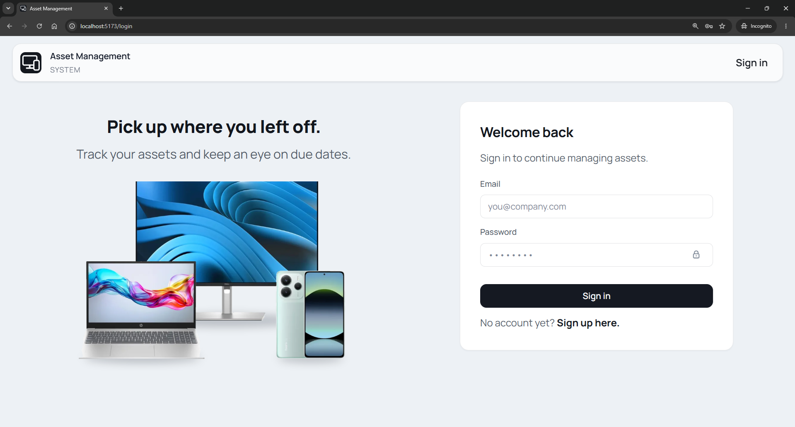
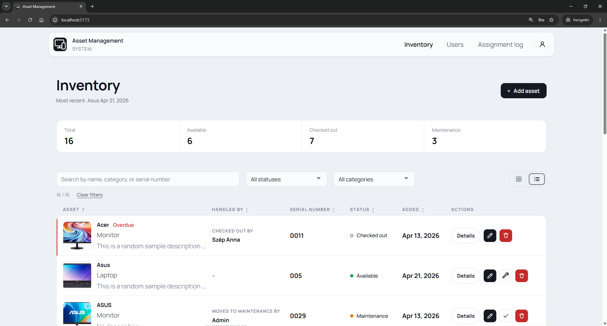
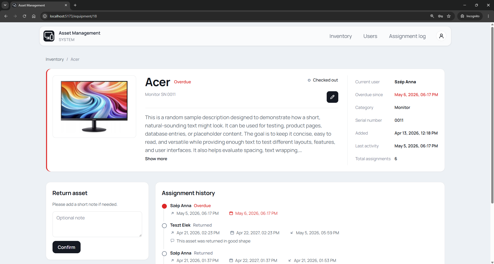
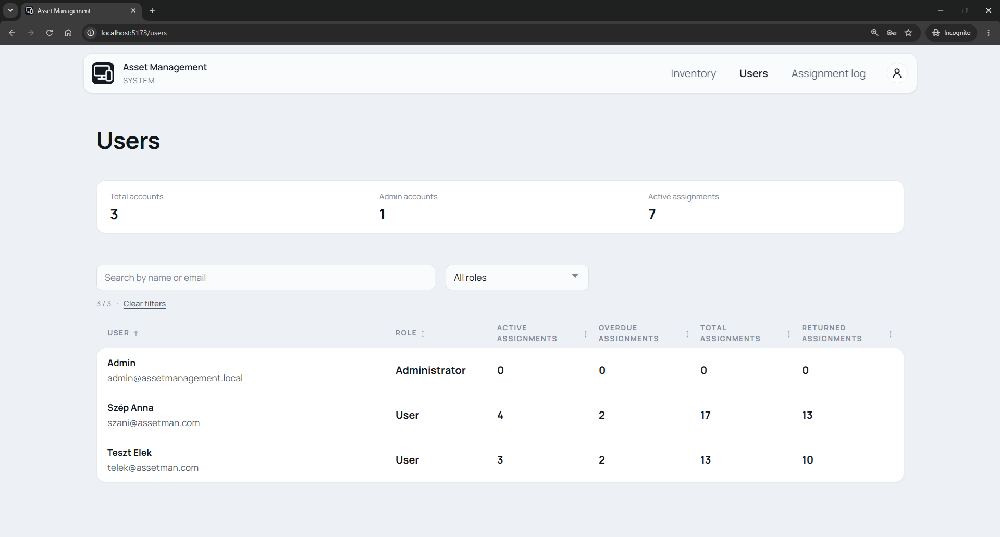
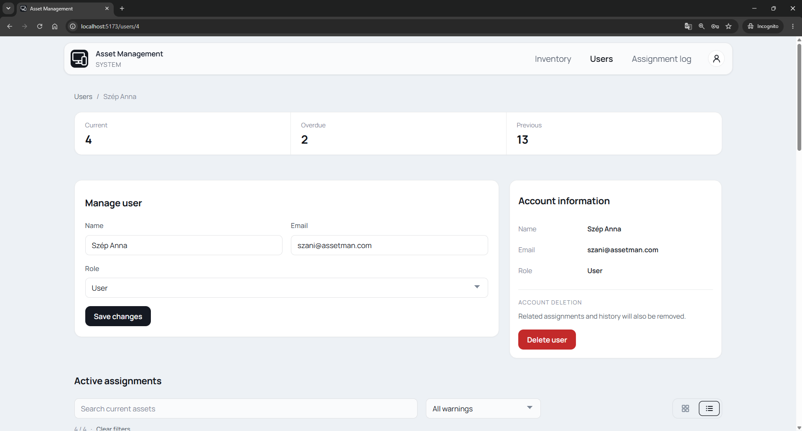
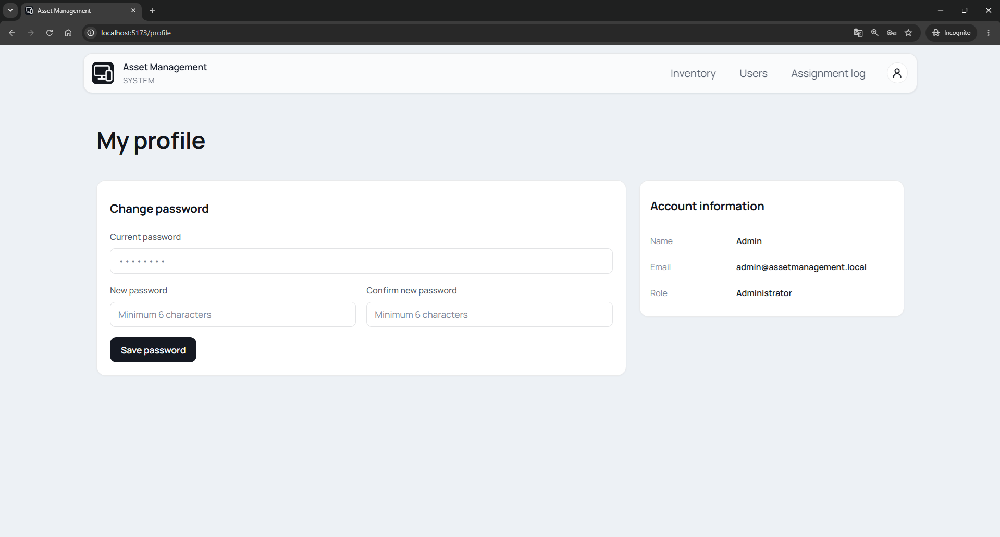
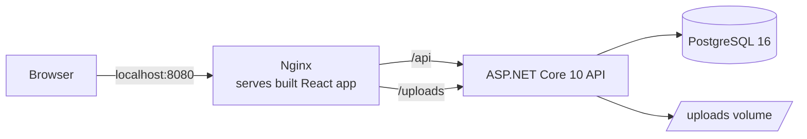
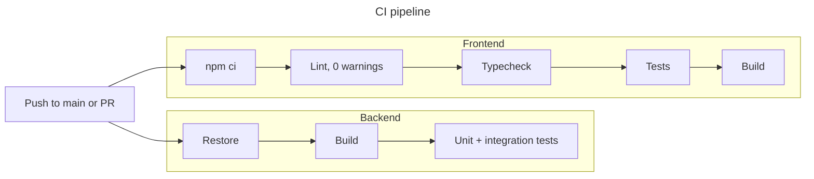

# Asset Management System

[](https://github.com/20davo/asset-management-system/actions/workflows/ci.yml)


This full-stack portfolio project is designed for smaller IT teams as an internal asset tracker. It is meant for those who have outgrown spreadsheets but do not need a full enterprise tool.

## Screenshots

| Login | Inventory |
| --- | --- |
|  |  |

<details>
<summary>More screenshots (asset details, user management, user details, profile)</summary>









</details>

## Features

- JWT login with rate limiting and two roles (admin and regular user)
- Self-registration for regular users, which can be turned off per environment
- Search, filters, due-date warnings, card and list views, and sortable columns across the app's lists
- Checkout and return flow with due dates, notes, and assignment history
- Admin tools for creating, editing, and deleting assets, moving them in and out of maintenance, and assigning them to users
- An assignment log for admins with filters
- User management with role editing, and a page for each user with their current assets and past assignments
- A `My Items` page where users see their active and returned assets
- Equipment photos, visible only to signed-in users
- Bilingual UI (English and Hungarian) with light and dark themes

## Engineering highlights

Some parts of the codebase that go beyond basic CRUD:

- **Every checkout is saved as its own record.** Each record keeps the due date and the return date, so past assignments stay visible. A partial unique index allows only one open checkout per asset, so two users cannot take the same asset at the same time. An integration test checks this in CI by sending two checkout requests at once, with a real PostgreSQL database behind the API.
- **Old sessions end right away.** On each request, the API checks the role and token version against the database, so after a role change, a password change, or account deletion, old tokens stop working. This costs one extra database query per request.
- **Images stay private.** Uploads are checked by their real file type (magic bytes), and only signed-in users can see them. The frontend loads each image with the token and shows it as a blob, because an `` tag cannot send a token.
- **Status changes have their own endpoints.** The general update endpoint cannot change an asset's status. Checkout, return, and maintenance go through separate endpoints, and each one checks whether the change is allowed. For example, a checked-out asset cannot go to maintenance.
- **Error messages use shared codes.** The API sends a code like `equipment.notAvailableForCheckout` with each error from the services, and the frontend turns it into an English or Hungarian message.
- **Search and filter settings are saved in the URL.** Search text, filters, sorting, and the card or list layout stay the same after a page refresh, and the same view can be shared as a link.

## Architecture


```mermaid
flowchart LR
    B[Browser] -->|"localhost:8080"| N["Nginx<br>serves built React app"]
    N -->|"/api"| A["ASP.NET Core 10 API"]
    N -->|"/uploads"| A
    A --> D[("PostgreSQL 16")]
    A --> V[/"uploads volume"/]
```

The diagram shows the **production-like** mode. The development stack has no Nginx. There the Vite dev server runs on port 5173 and calls the API directly on port 5071, with CORS configured for it.

Each backend request goes through a thin controller to a service layer behind interfaces, which uses EF Core with PostgreSQL. Responses use DTOs, so EF entities never leave the API.

```text
api/AssetManagement/      ASP.NET Core solution (API project and two test projects)
frontend/                 React + TypeScript app (Vite)
compose.yaml              development stack
compose.prod.yaml         production-like overrides (Nginx, no exposed API/DB ports)
.github/workflows/ci.yml  CI pipeline
```

## Getting started

You need Docker Desktop (or Docker Engine with Compose).

```sh
cp .env.example .env
docker compose up --build -d
```

Open `http://localhost:5173`. The example values are ready for local development, including a bootstrap admin account:

- email: `admin@assetmanagement.local`
- password: `Admin123!`

EF Core migrations run automatically on startup, and the bootstrap admin is created from the `.env` values. Public registration creates regular user accounts only.

### Production-like mode

```sh
docker compose -f compose.yaml -f compose.prod.yaml up --build -d
```

Open `http://localhost:8080`. In this mode the frontend is a static build served by Nginx, everything runs on one origin, registration is disabled, and login rate limiting is on.

## Configuration

All settings come from a root `.env` file, documented in [.env.example](./.env.example). The main groups:

- host ports and PostgreSQL credentials
- JWT key, issuer, and audience (the API does not start without a key, and the example key is for local use only)
- registration and bootstrap admin switches
- login rate limit settings
- CORS origins

Database data, uploaded images, and ASP.NET Data Protection keys live in named Docker volumes, so they are kept when containers are recreated.

## Tests and CI

- **Backend, 22 xUnit tests.** Controller-level tests using an in-memory EF Core database. They cover auth rules, the equipment and checkout lifecycle, and user management edge cases such as last-admin protection.
- **Backend, 3 integration tests.** Full HTTP tests against a real PostgreSQL container via Testcontainers. They cover the concurrent checkout race, the duplicate-registration race, and token invalidation on password change. Running them requires Docker.
- **Frontend, 25 Vitest tests.** API error and message mapping, the success and error message component, the asset form, the page language setting, and a check that the English and Hungarian texts have the same keys. The component tests use Testing Library.

To run the tests locally, you need the .NET 10 SDK and Node.js.

```sh
# backend
cd api/AssetManagement && dotnet test

# frontend
cd frontend && npm ci && npm run test
```

GitHub Actions runs this pipeline automatically.


```mermaid
---
title: CI pipeline
---
%%{init: {"flowchart": {"nodeSpacing": 20}}}%%
flowchart LR
    T["Push to main or PR"] --> B1
    T --> F1
    subgraph Backend
        B1["Restore"] --> B2["Build"] --> B3["Unit + integration tests"]
    end
    subgraph Frontend
        F1["npm ci"] --> F2["Lint, 0 warnings"] --> F3["Typecheck"] --> F4["Tests"] --> F5["Build"]
    end
```

## API overview

The API serves JSON under `/api` with JWT Bearer authentication, and Swagger UI is available in development mode. In the endpoints, `checkout` means one assignment record of an asset to a user.

<details>
<summary>Endpoint reference</summary>

### Authentication

| Method | Endpoint | Access | Purpose |
| --- | --- | --- | --- |
| `POST` | `/api/auth/register` | Public when enabled | Register a regular user |
| `POST` | `/api/auth/login` | Public | Sign in and receive a JWT |
| `POST` | `/api/auth/change-password` | Signed-in users | Change the current user's password |

### Equipment

| Method | Endpoint | Access | Purpose |
| --- | --- | --- | --- |
| `GET` | `/api/equipment` | Signed-in users | List inventory items |
| `GET` | `/api/equipment/{id}` | Signed-in users | Get asset details |
| `POST` | `/api/equipment` | Admin | Create an asset, optionally with an image |
| `PUT` | `/api/equipment/{id}` | Admin | Update asset details and image |
| `DELETE` | `/api/equipment/{id}` | Admin | Delete an asset if it is not assigned |
| `POST` | `/api/equipment/{id}/checkout` | Signed-in users | Create an asset assignment |
| `POST` | `/api/equipment/{id}/return` | Assigned user or admin | Return an asset and close the assignment |
| `POST` | `/api/equipment/{id}/mark-maintenance` | Admin | Move an available asset to maintenance |
| `POST` | `/api/equipment/{id}/mark-available` | Admin | Move a maintenance asset back to available |
| `GET` | `/uploads/equipment/{fileName}` | Signed-in users | Load a protected equipment image |

### Asset assignments

| Method | Endpoint | Access | Purpose |
| --- | --- | --- | --- |
| `GET` | `/api/checkout` | Admin | List all assignment records |
| `GET` | `/api/checkout/{id}` | Admin | Get one assignment record |
| `GET` | `/api/checkout/user/{userId}` | Admin | List a user's assignment history |
| `GET` | `/api/checkout/my` | Signed-in users | List the current user's assignment history |

### Users

| Method | Endpoint | Access | Purpose |
| --- | --- | --- | --- |
| `GET` | `/api/users` | Admin | List users |
| `GET` | `/api/users/{id}` | Admin | Get one user |
| `PUT` | `/api/users/{id}` | Admin | Update name, email, and role |
| `DELETE` | `/api/users/{id}` | Admin | Delete a user and their assignment records |

</details>

Some rules the API checks beyond the access levels above:

- the last admin account cannot be deleted, and admins cannot remove their own admin role
- assets with an active assignment cannot be deleted
- admins assign assets to regular users and cannot assign assets to themselves

## Known limitations

This is a portfolio project, so some production decisions are intentionally simple. These are the trade-offs I know about and the direction I would take next:

| Current state | Production direction |
| --- | --- |
| JWT stored in browser `localStorage` | Secure `HttpOnly` cookies |
| Two fixed roles (admin, user) | Policy-based authorization for finer permissions |
| Deleting a user or an asset also deletes its assignment history | Deactivate users and archive assets instead, so the history is kept |
| IP-based login rate limiting | Add per-account lockout rules |
| EF Core migrations run on startup | Separate migration step in deployment, with backups |
| Uploads stored on a Docker volume | Object storage with scanning and backups |
| Secrets come from local environment variables | Secret manager in deployed environments |
| No HTTPS or real domain in the local setup | TLS, domain routing, certificate renewal |
| Unit tests plus API integration tests | Frontend end-to-end coverage |
| No monitoring | Structured logs, health checks, metrics, error tracking |

## License

This repository is public for review as a portfolio project, but it is not released as open-source software. See [LICENSE](./LICENSE).
